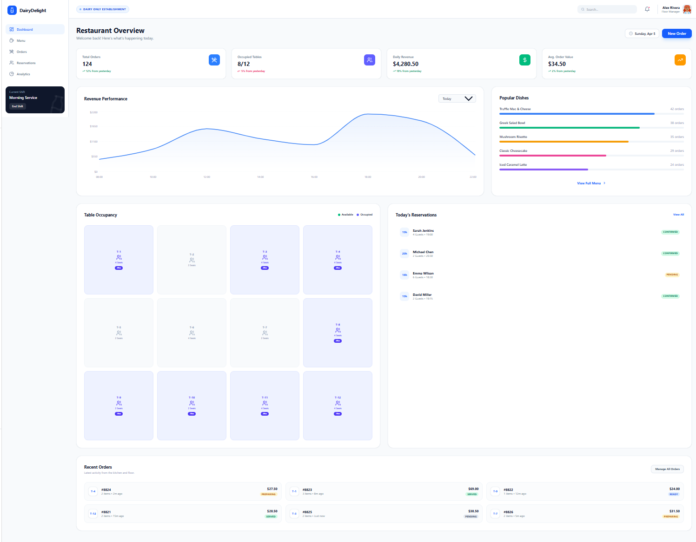
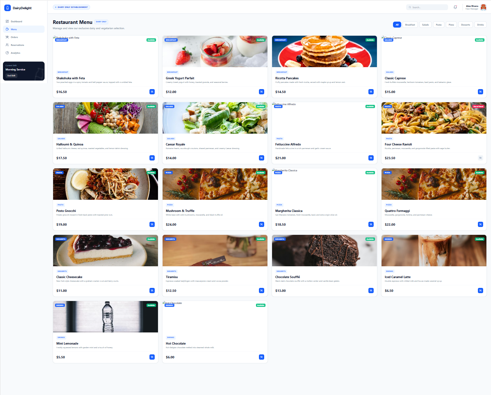
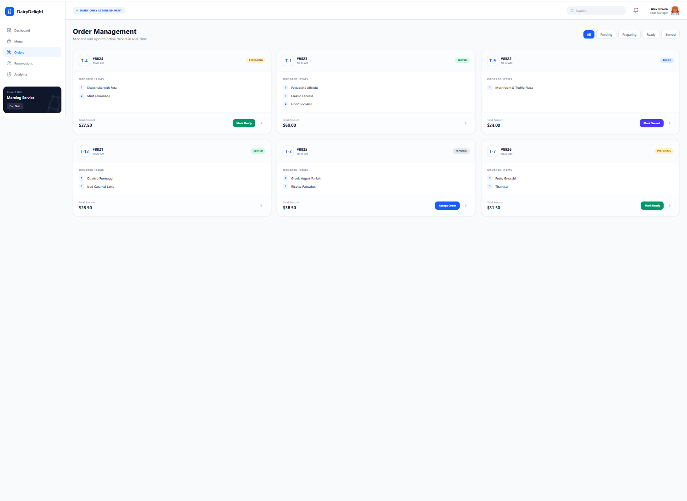
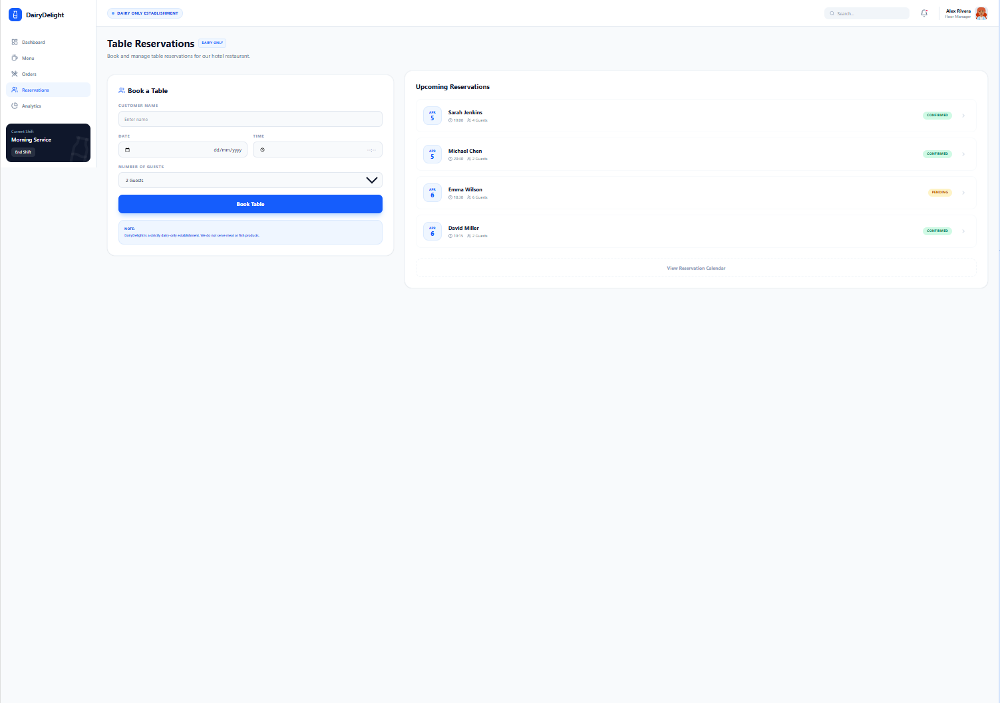
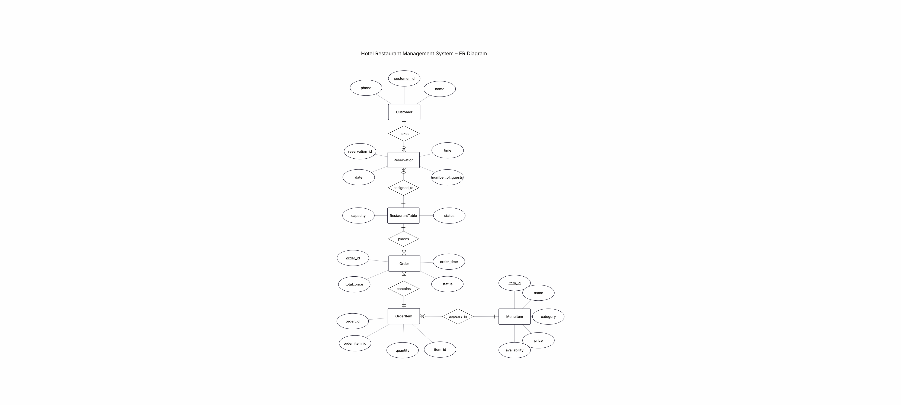

Created using Google AI Studio

# Hotel Management System – Restaurant Module (Dairy Only)

## 📌 Project Overview
This project focuses on the Restaurant & Food module of a hotel management system.  
The system is designed for a **dairy-only restaurant**, meaning all menu items are dairy or vegetarian, with no meat or fish products.

The goal is to provide an intuitive and modern interface for managing restaurant operations, including menu management, orders, reservations, and analytics.

---

## 🖥️ UI Screens (Google AI Studio)

### 🔹 Screen 1 – Dashboard

This dashboard provides an overview of restaurant activity, including total orders, revenue, table occupancy, and popular dishes.  
It helps managers monitor performance and make quick decisions.

---

### 🔹 Screen 2 – Menu Management

This screen displays all menu items in a dairy-only restaurant.  
Managers can view dishes, categories, prices, and availability in a clear and organized layout.

---

### 🔹 Screen 3 – Order Management

This screen allows staff to manage and track customer orders in real-time.  
Orders are displayed with table number, items, and status (Pending, Preparing, Ready, Served).

---

### 🔹 Screen 4 – Table Reservation

This screen allows booking and managing table reservations.  
Users can enter customer details, date, time, and number of guests.

---

## 🏢 Organization Description
The system represents a hotel restaurant called **"DairyDelight"**, which serves only dairy and vegetarian food.  
It is designed to improve efficiency in daily operations, enhance user experience, and provide clear management tools for restaurant staff and managers.

---

## 🗄️ ER Diagram

The system is based on several main entities:

- Customer – stores customer details (id, name, phone)  
- Reservation – stores reservation details (date, time, number of guests)  
- RestaurantTable – represents tables in the restaurant (capacity, status)  
- Order – represents orders made in the restaurant  
- OrderItem – connects between orders and menu items  
- MenuItem – represents dishes in the menu (name, category, price, availability)  

### Relationships:

- A Customer makes Reservations (one customer can have multiple reservations)  
- Each Reservation is assigned to one Table  
- A Table can have multiple Orders  
- An Order contains multiple OrderItems  
- Each OrderItem is linked to one MenuItem  
