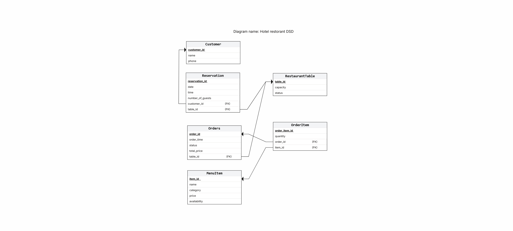

Created using Google AI Studio

# Hotel Management System – Restaurant Module (Dairy Only)

## 📌 Project Overview
This project focuses on the Restaurant & Food module of a hotel management system.  
The system is designed for a **dairy-only restaurant**, meaning all menu items are dairy or vegetarian, with no meat or fish products.

The goal is to provide an intuitive and modern interface for managing restaurant operations, including menu management, orders, reservations, and analytics.

---

## 🖥️ UI Screens (Google AI Studio)

https://ai.studio/apps/3cb0f4c9-3878-4d29-a612-cc7284a6e892

### 🔹 Screen 1 – Dashboard


This dashboard provides an overview of restaurant activity, including total orders, revenue, table occupancy, and popular dishes.  
It helps managers monitor performance and make quick decisions.

---

### 🔹 Screen 2 – Menu Management


This screen displays all menu items in a dairy-only restaurant.  
Managers can view dishes, categories, prices, and availability in a clear and organized layout.

---

### 🔹 Screen 3 – Order Management


This screen allows staff to manage and track customer orders in real-time.  
Orders are displayed with table number, items, and status (Pending, Preparing, Ready, Served).

---

### 🔹 Screen 4 – Table Reservation


This screen allows booking and managing table reservations.  
Users can enter customer details, date, time, and number of guests.

---

## 🏢 Organization Description
The system represents a hotel restaurant called **"DairyDelight"**, which serves only dairy and vegetarian food.  
It is designed to improve efficiency in daily operations, enhance user experience, and provide clear management tools for restaurant staff and managers.

---

## 🗄️ ER Diagram


The system is based on several main entities:

- Customer – stores customer details (id, name, phone)  
- Reservation – stores reservation details (date, time, number of guests)  
- RestaurantTable – represents tables in the restaurant (capacity, status)  
- Order – represents orders made in the restaurant  
- OrderItem – connects between orders and menu items  
- MenuItem – represents dishes in the menu (name, category, price, availability)  

### Relationships:

- A Customer makes Reservations (one customer can have multiple reservations)  
- Each Reservation is assigned to one Table  
- A Table can have multiple Orders  
- An Order contains multiple OrderItems  
- Each OrderItem is linked to one MenuItem

## 🗂️ Database Schema Diagram (DSD)



The Database Schema Diagram (DSD) represents the relational structure of the restaurant module after converting the ERD into database tables.

It shows the primary keys and foreign keys used to connect the entities in the system and reflects how the data will actually be stored in the database.

### Main Tables in the DSD:

- **Customer** – stores customer information such as `customer_id`, `name`, and `phone`
- **Reservation** – stores reservation details such as `reservation_id`, `date`, `time`, `number_of_guests`, and links to the customer and table
- **RestaurantTable** – stores restaurant table details such as `table_id`, `capacity`, and `status`
- **Orders** – stores order information such as `order_id`, `order_time`, `status`, `total_price`, and the related table
- **OrderItem** – a junction table that connects orders with menu items and stores the quantity of each item in the order
- **MenuItem** – stores menu dish information such as `item_id`, `name`, `category`, `price`, and `availability`

### Foreign Key Relationships:

- `Reservation.customer_id` → `Customer.customer_id`
- `Reservation.table_id` → `RestaurantTable.table_id`
- `Orders.table_id` → `RestaurantTable.table_id`
- `OrderItem.order_id` → `Orders.order_id`
- `OrderItem.item_id` → `MenuItem.item_id`

### Purpose of the DSD:

The DSD helps translate the conceptual ERD design into an actual relational database structure.  
It ensures that the tables are properly connected, reduces redundancy, and supports efficient data storage and retrieval.

# Data Dictionary

This data dictionary describes the database tables of the restaurant management system.  
It includes the purpose of each table, its attributes, primary keys, foreign keys, and constraints.

---

## Customer
**Purpose:** Stores information about restaurant customers.

| Field | Type | Description |
|------|------|------------|
| customer_id | INT | Unique identifier for each customer |
| name | VARCHAR(100) | Customer full name |
| phone | VARCHAR(20) | Customer phone number |

**Primary Key:**  
- customer_id  

**Constraints:**  
- All fields are NOT NULL  
- phone is UNIQUE  

---

## RestaurantTable
**Purpose:** Stores information about restaurant tables.

| Field | Type | Description |
|------|------|------------|
| table_id | INT | Unique identifier for each table |
| capacity | INT | Number of seats at the table |
| status | VARCHAR(20) | Current table status |

**Primary Key:**  
- table_id  

**Constraints:**  
- capacity > 0  
- status IN ('available', 'reserved', 'occupied')  

---

## Reservation
**Purpose:** Stores reservations made by customers.

| Field | Type | Description |
|------|------|------------|
| reservation_id | INT | Unique identifier for each reservation |
| date | DATE | Reservation date |
| time | TIME | Reservation time |
| number_of_guests | INT | Number of guests |
| customer_id | INT | Related customer |
| table_id | INT | Assigned table |

**Primary Key:**  
- reservation_id  

**Foreign Keys:**  
- customer_id → Customer(customer_id)  
- table_id → RestaurantTable(table_id)  

**Constraints:**  
- number_of_guests > 0  
- All fields are NOT NULL  

---

## Orders
**Purpose:** Stores food orders in the restaurant.

| Field | Type | Description |
|------|------|------------|
| order_id | INT | Unique identifier for each order |
| order_time | TIME | Time of the order |
| status | VARCHAR(20) | Order status |
| total_price | DECIMAL(10,2) | Total order price |
| table_id | INT | Table that placed the order |

**Primary Key:**  
- order_id  

**Foreign Keys:**  
- table_id → RestaurantTable(table_id)  

**Constraints:**  
- total_price >= 0  
- status IN ('pending', 'preparing', 'served', 'cancelled')  
- All fields are NOT NULL  

---

## MenuItem
**Purpose:** Stores menu items offered by the restaurant.

| Field | Type | Description |
|------|------|------------|
| item_id | INT | Unique identifier for each item |
| name | VARCHAR(100) | Item name |
| category | VARCHAR(50) | Item category |
| price | DECIMAL(10,2) | Item price |
| availability | BOOLEAN | Availability status |

**Primary Key:**  
- item_id  

**Constraints:**  
- price >= 0  
- All fields are NOT NULL  

---

## OrderItem
**Purpose:** Links orders with menu items and stores quantities.

| Field | Type | Description |
|------|------|------------|
| order_item_id | INT | Unique identifier |
| quantity | INT | Quantity ordered |
| order_id | INT | Related order |
| item_id | INT | Related menu item |

**Primary Key:**  
- order_item_id  

**Foreign Keys:**  
- order_id → Orders(order_id)  
- item_id → MenuItem(item_id)  

**Constraints:**  
- quantity > 0  
- All fields are NOT NULL  

---

## Summary
The database is designed in Third Normal Form (3NF).  
Each table represents a single entity, and all attributes depend only on the primary key.  
Constraints are used to ensure data integrity and prevent invalid data entry.

### createTables.sql


### dropTables.sql

This file contains DROP TABLE commands for deleting all database tables in an order that respects the foreign key dependencies between them.  
The dependent tables are dropped first, allowing the script to run smoothly without constraint errors.

### Backup Process:

We created a backup of the database using two different methods:

1. Command line:
We used the pg_dump command through Docker:
docker exec db_postgres pg_dump -U admin -d restaurant > backup_01_05_26.sql

2. pgAdmin UI:
We used the Backup option from pgAdmin.

To verify the backup, we restored it into a new database named "restaurant_backup" using:
Get-Content backup_01_05_26.sql | docker exec -i db_postgres psql -U admin -d restaurant_backup

We confirmed that the restore was successful by checking that all tables and data were correctly loaded.


### STAGE 2:

## Queries.sql – Query Explanations

This file contains advanced SQL queries for the restaurant database.  
The SELECT queries are written in pairs, where each pair solves the same task in two different ways in order to compare efficiency and query structure.

---

<details>
<summary>Query 1A + 1B – לקוחות עם מספר ההזמנות הגבוה ביותר</summary>

מטרת השאילתה היא להציג את הלקוחות שביצעו את מספר ההזמנות הגבוה ביותר במסעדה.  
השאילתה מציגה את מזהה הלקוח, שם הלקוח, מספר הטלפון, מספר ההזמנות הכולל ומספר הסועדים הכולל.

### Query 1A – Using JOIN

```sql
SELECT
    c.customer_id,
    c.name AS customer_name,
    c.phone,
    COUNT(r.reservation_id) AS total_reservations,
    SUM(r.number_of_guests) AS total_guests
FROM Customer c
JOIN Reservation r
ON c.customer_id = r.customer_id
GROUP BY c.customer_id, c.name, c.phone
ORDER BY total_reservations DESC;
```


### Query 1B – Using Subquery

```sql
SELECT
    c.customer_id,
    c.name AS customer_name,
    c.phone,
    reservation_data.total_reservations,
    reservation_data.total_guests
FROM Customer c
JOIN (
    SELECT
        customer_id,
        COUNT(reservation_id) AS total_reservations,
        SUM(number_of_guests) AS total_guests
    FROM Reservation
    GROUP BY customer_id
) AS reservation_data
ON c.customer_id = reservation_data.customer_id
ORDER BY reservation_data.total_reservations DESC;
```


### Efficiency Explanation

Query 1A uses a direct JOIN, while Query 1B first calculates reservation statistics inside a subquery and then joins the result with Customer.  
In many cases, the JOIN version is simpler and can be more efficient because the database optimizer can process the join and aggregation directly.  
The subquery version is clearer when we want to separate the calculation stage from the customer details stage.

</details>

---

<details>
<summary>Query 2A + 2B – שולחנות ללא הזמנות</summary>

מטרת השאילתה היא למצוא שולחנות במסעדה שאין להם הזמנות כלל.  
השאילתה מציגה את מספר השולחן, הקיבולת, הסטטוס ומספר ההזמנות.

### Query 2A – Using LEFT JOIN

```sql
SELECT
    rt.table_id,
    rt.capacity,
    rt.status,
    COUNT(r.reservation_id) AS reservation_count
FROM RestaurantTable rt
LEFT JOIN Reservation r
ON rt.table_id = r.table_id
GROUP BY rt.table_id, rt.capacity, rt.status
HAVING COUNT(r.reservation_id) = 0
ORDER BY rt.table_id;
```


### Query 2B – Using NOT EXISTS

```sql
SELECT
    rt.table_id,
    rt.capacity,
    rt.status,
    0 AS reservation_count
FROM RestaurantTable rt
WHERE NOT EXISTS (
    SELECT 1
    FROM Reservation r
    WHERE r.table_id = rt.table_id
)
ORDER BY rt.table_id;
```


### Efficiency Explanation

Query 2A uses LEFT JOIN and then filters tables with no reservations using HAVING.  
Query 2B uses NOT EXISTS and checks whether a matching reservation exists for each table.  
For large tables, NOT EXISTS is often more efficient because the database can stop searching as soon as it finds a matching row.

</details>

---

<details>
<summary>Query 3A + 3B – סטטיסטיקת הזמנות לפי חודש ושנה</summary>

מטרת השאילתה היא להציג סטטיסטיקות של הזמנות לפי חודש ושנה.  
השאילתה משתמשת בשדה התאריך ומפרקת אותו לשנה וחודש באמצעות EXTRACT.

### Query 3A – Using GROUP BY directly

```sql
SELECT
    EXTRACT(YEAR FROM r.date) AS reservation_year,
    EXTRACT(MONTH FROM r.date) AS reservation_month,
    COUNT(r.reservation_id) AS total_reservations,
    SUM(r.number_of_guests) AS total_guests,
    AVG(r.number_of_guests) AS average_guests
FROM Reservation r
GROUP BY
    EXTRACT(YEAR FROM r.date),
    EXTRACT(MONTH FROM r.date)
ORDER BY reservation_year, reservation_month;
```


### Query 3B – Using Subquery

```sql
SELECT
    reservation_data.reservation_year,
    reservation_data.reservation_month,
    COUNT(*) AS total_reservations,
    SUM(reservation_data.number_of_guests) AS total_guests,
    AVG(reservation_data.number_of_guests) AS average_guests
FROM (
    SELECT
        reservation_id,
        number_of_guests,
        EXTRACT(YEAR FROM date) AS reservation_year,
        EXTRACT(MONTH FROM date) AS reservation_month
    FROM Reservation
) AS reservation_data
GROUP BY
    reservation_data.reservation_year,
    reservation_data.reservation_month
ORDER BY
    reservation_data.reservation_year,
    reservation_data.reservation_month;
```


### Efficiency Explanation

Query 3A performs the date extraction and grouping directly in the main query.  
Query 3B first extracts the year and month in a subquery, and only then groups the results.  
Query 3A is usually more direct and efficient, while Query 3B is more readable when the date processing logic becomes more complex.

</details>

---

<details>
<summary>Query 4A + 4B – הכנסות לפי קטגוריית מנות</summary>

מטרת השאילתה היא לחשב את ההכנסות מכל קטגוריית מנות במסעדה.  
השאילתה מציגה קטגוריה, מספר מנות, כמות פריטים שנמכרו, הכנסה כוללת ומחיר ממוצע.

### Query 4A – Using JOIN

```sql
SELECT
    mi.category,
    COUNT(DISTINCT mi.item_id) AS number_of_items,
    SUM(oi.quantity) AS total_items_sold,
    SUM(oi.quantity * mi.price) AS total_revenue,
    AVG(mi.price) AS average_price
FROM MenuItem mi
JOIN OrderItem oi
ON mi.item_id = oi.item_id
GROUP BY mi.category
ORDER BY total_revenue DESC;
```


### Query 4B – Using Subquery

```sql
SELECT
    category_data.category,
    COUNT(DISTINCT category_data.item_id) AS number_of_items,
    SUM(category_data.quantity) AS total_items_sold,
    SUM(category_data.item_total) AS total_revenue,
    AVG(category_data.price) AS average_price
FROM (
    SELECT
        mi.item_id,
        mi.category,
        mi.price,
        oi.quantity,
        (oi.quantity * mi.price) AS item_total
    FROM MenuItem mi
    JOIN OrderItem oi
    ON mi.item_id = oi.item_id
) AS category_data
GROUP BY category_data.category
ORDER BY total_revenue DESC;
```


### Efficiency Explanation

Query 4A calculates the revenue directly using JOIN and GROUP BY.  
Query 4B first creates a calculated result in a subquery and then groups it by category.  
Query 4A is usually more efficient because it avoids an additional intermediate result, while Query 4B can be easier to understand because it separates the item-level calculation from the category summary.

</details>

---

## UPDATE Queries

### Update 1 – עדכון מנות לא זמינות

מטרת השאילתה היא לסמן מנות שלא הוזמנו מעולם כלא זמינות.

```sql
UPDATE MenuItem
SET availability = false
WHERE item_id NOT IN (
    SELECT DISTINCT item_id
    FROM OrderItem
);
```
### צילום בסיס הנתונים לפני העדכון

כאן ניתן לראות מנות שלא הופיעו בטבלת ההזמנות, כאשר חלקן עדיין סומנו כזמינות (`true`).


### צילום הרצת השאילתה

כאן ניתן לראות את הרצת שאילתת ה־UPDATE והודעת המערכת שמציינת כי 500 רשומות עודכנו בהצלחה.

### צילום בסיס הנתונים אחרי העדכון

לאחר הרצת השאילתה ניתן לראות שכל המנות שלא הופיעו בהזמנות עודכנו לערך `false` בשדה `availability`.


### Update 2 – עדכון סטטוס שולחנות

מטרת השאילתה היא לעדכן את סטטוס השולחנות ל־reserved אם קיימת עבורם הזמנה עתידית.

```sql
UPDATE RestaurantTable
SET status = 'reserved'
WHERE table_id IN (
    SELECT DISTINCT table_id
    FROM Reservation
    WHERE date >= CURRENT_DATE
);
```
### צילום בסיס הנתונים לפני העדכון

כאן ניתן לראות שולחנות בעלי הזמנות עתידיות לפני שינוי הסטטוס.


### צילום הרצת השאילתה

כאן ניתן לראות את הרצת שאילתת ה־UPDATE והודעת המערכת שמציינת כמה רשומות עודכנו.


### צילום בסיס הנתונים אחרי העדכון

לאחר הרצת השאילתה ניתן לראות שהשדה `status` של השולחנות בעלי ההזמנות העתידיות עודכן לערך `reserved`.


### Update 3 – חישוב מחדש של מחיר הזמנה

מטרת השאילתה היא לחשב מחדש את המחיר הכולל של כל הזמנה לפי כמות הפריטים ומחיר כל מנה.

```sql
UPDATE Orders
SET total_price = order_totals.new_total
FROM (
    SELECT
        oi.order_id,
        SUM(oi.quantity * mi.price) AS new_total
    FROM OrderItem oi
    JOIN MenuItem mi
    ON oi.item_id = mi.item_id
    GROUP BY oi.order_id
) AS order_totals
WHERE Orders.order_id = order_totals.order_id;
```
### צילום בסיס הנתונים לפני העדכון

כאן ניתן לראות את מחירי ההזמנות לפני חישוב מחדש של המחיר הכולל.


### צילום הרצת השאילתה

כאן ניתן לראות את הרצת שאילתת ה־UPDATE.  
המערכת החזירה `UPDATE 0`, כלומר לא נמצאו רשומות שדורשות שינוי, מכיוון שהמחירים בטבלת `Orders` כבר היו מעודכנים ונכונים בהתאם לנתוני ההזמנות.


### צילום בסיס הנתונים אחרי העדכון

לאחר הרצת השאילתה ניתן לראות שלא חל שינוי בנתונים, משום שמחירי ההזמנות כבר תאמו לחישוב שבוצע מתוך טבלאות `OrderItem` ו־`MenuItem`.


---

## DELETE Queries

### Delete 1 – מחיקת הזמנות שבוטלו

מטרת השאילתה היא למחוק הזמנות שהסטטוס שלהן הוא cancelled.

```sql
DELETE FROM Orders
WHERE status = 'cancelled';
```

### צילום בסיס הנתונים לפני המחיקה

כאן ניתן לראות הזמנות בעלות סטטוס `cancelled` לפני ביצוע המחיקה.

### צילום הרצת השאילתה

כאן ניתן לראות את הרצת שאילתת ה־DELETE.  
המערכת החזירה `DELETE 4983`, כלומר נמחקו 4983 הזמנות שבוטלו.


### צילום בסיס הנתונים אחרי המחיקה

לאחר הרצת השאילתה ניתן לראות שלא קיימות יותר הזמנות בעלות סטטוס `cancelled` בטבלת `Orders`.


### Delete 2 – מחיקת הזמנות ישנות

מטרת השאילתה היא למחוק הזמנות משנים קודמות לפי שדה התאריך.

```sql
DELETE FROM Reservation
WHERE EXTRACT(YEAR FROM date) < EXTRACT(YEAR FROM CURRENT_DATE);
```
### צילום בסיס הנתונים לפני המחיקה

כאן ניתן לראות רשומת הזמנה ישנה משנת 2024 לפני ביצוע המחיקה.


### צילום הרצת השאילתה

כאן ניתן לראות את הרצת שאילתת ה־DELETE והודעת המערכת שמציינת כמה רשומות נמחקו.


### צילום בסיס הנתונים אחרי המחיקה

לאחר הרצת השאילתה ניתן לראות שההזמנות הישנות נמחקו מטבלת `Reservation`, ולא קיימות יותר רשומות משנים קודמות.


### Delete 3 – מחיקת מנות לא זמינות

מטרת השאילתה היא למחוק מנות שסומנו כלא זמינות.

```sql
DELETE FROM MenuItem
WHERE availability = false;
```
### צילום בסיס הנתונים לפני המחיקה

כאן ניתן לראות מנות שסומנו כלא זמינות ואינן מופיעות בהזמנות לפני ביצוע המחיקה.

### צילום הרצת השאילתה

כאן ניתן לראות את הרצת שאילתת ה־DELETE ואת הודעת המערכת המציינת כמה רשומות נמחקו.


### צילום בסיס הנתונים אחרי המחיקה

לאחר הרצת השאילתה ניתן לראות שהמנות שסומנו כלא זמינות ואינן מקושרות להזמנות הוסרו מטבלת `MenuItem`.

